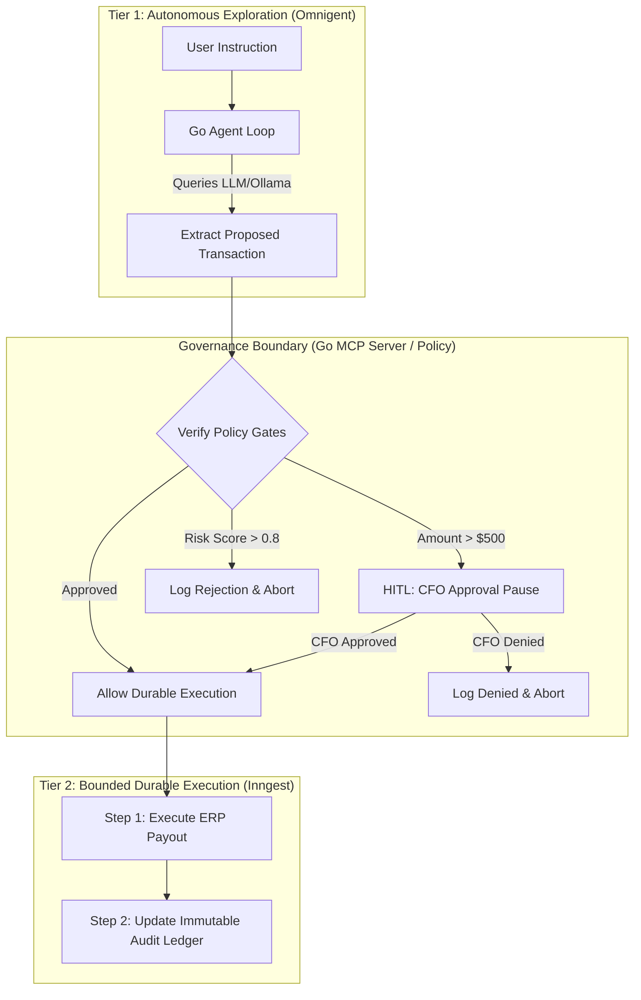

# Two-Tier Safe AI Gate (Go + Inngest + Omnigent)

[](https://golang.org)
[](https://inngest.com)
[](https://omnigent.ai)
[](LICENSE)

---

**Problem:** LLM agents in high-stakes operational environments (such as financial payouts, customer refunds, or logistics dispatch) must never directly run state-changing operations. Their actions must be governed by policy boundaries and executed via fault-tolerant durable processes.

**Solution:** A two-tier architectural gate written in Go:
1. **Tier 1 (Autonomous Exploration):** The agent loop interprets instructions, planning state-changing proposals in a sandbox.
2. **Deterministic Governance Gate (Omnigent / Go MCP):** Validates proposals against structural safety/budget rules before execution.
3. **Tier 2 (Bounded Durable Execution - Inngest):** Executes the approved transaction step-by-step with automatic backoff retries, timeouts, and state tracking.

---

## System Architecture



---

## Directory Structure

```text
├── agent/
│   └── loop.go          # Tier 1 autonomous parser (LLM / Mock extraction)
├── gate/
│   └── policy.go        # Deterministic policy validation boundary rules
├── workflow/
│   └── durable.go       # Tier 2 durable step execution in Go (Inngest handler)
├── mcp/
│   └── server.go        # Go-native Model Context Protocol stdio server wrapper
├── main.go              # Composition root (FastAPI-like endpoints & CLI runner)
├── omnigent.yaml        # Omnigent harness config (cost limits, HITL triggers)
├── docker-compose.yml   # Dev stack orchestration (App + Inngest Dev Server)
└── Dockerfile           # Multi-stage containerizer
```

---

## Quick Start

### 1. Launch the Stack
Start the Go API server and the Inngest Dev Server locally:
```bash
docker compose up --build
```

- **Go API Server:** `http://localhost:8090`
- **Inngest Dev Panel:** `http://localhost:8288` (where you can view active runs, payloads, and step-level executions)

### 2. Trigger an Autonomous Agent Run (Tier 1)
Post an instruction to the agent run endpoint:
```bash
curl -X POST http://localhost:8090/run \
  -H "Content-Type: application/json" \
  -d '{"instruction": "Refund customer user_481 $250.00 for the defective monitor"}'
```

The Go agent will extract the payout proposal and queue the `agent/payout.proposed` event to Inngest.

### 3. CFO Human-in-the-Loop Approval (HITL)
If the proposed transaction exceeds `$500.00`, the Inngest workflow will pause and wait for CFO approval. You can submit the CFO decision via:
```bash
curl -X POST http://localhost:8090/approve \
  -H "Content-Type: application/json" \
  -d '{"transaction_id": "<transaction-id-from-step-2>", "approved": true}'
```

---

## Omnigent Governance & MCP Integration

This project is ready to be co-driven by **Omnigent** using the bundled `omnigent.yaml` harness:
- Exposes our Go verification rules as an MCP tool registry to any Omnigent agent.
- Defines stateful cost policies (max `$100` budget per session).
- Sandboxes filesytem access.

---

## Related

- [**ertval.github.io**](https://ertval.github.io) — Portfolio & CV
- [**two-tier-safe-ai-gate**](https://github.com/ertval/two-tier-safe-ai-gate) — Safe AI execution model (Go + Inngest + Omnigent)
- [**keel-multi-agent-pipeline**](https://github.com/ertval/keel-multi-agent-pipeline) — Multi-agent maritime intelligence (Python + LangGraph)
- [**social-network**](https://github.com/ertval/social-network) — Go vertical-slices full-stack monolith (Next.js)
- [**make-your-game**](https://github.com/ertval/make-your-game) — Pure JS ECS game engine
- [**real-time-forum**](https://github.com/ertval/real-time-forum) — Go + Vanilla JS real-time WebSocket SPA
- [**forum**](https://github.com/ertval/forum) — Go hexagonal architecture monolith (zero-dependency)
